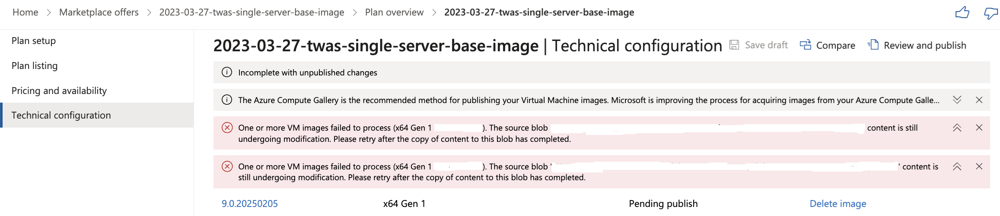
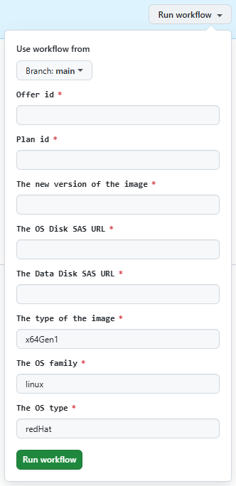

<!-- Copyright (c) Microsoft Corporation. -->
<!-- Copyright (c) IBM Corporation. -->

# GitHub Actions automation

This automation aims to simplify the process for keeping the Partner Center offers for WebSphere traditional up to date, with the latest fix packs, iFixes, yum updates, etc. At a high level, the least-effort update involves the following steps.

- Incrementing the versions in several `pom.xml` files.
- Updating a property in a few JSON files.
- Running a few GitHub Actions workflows.
- Selecting a few buttons in Partner Center.

This document describes two different approaches for causing an update to the code in this repository to be packaged, published and made available to users in Partner Center.

   - The automated process
   - The manual process.

Use of the processes is not mutually exclusive. Both processes share code to avoid DRY violations.  The shared code does a number of "software update" type actions such as `yum update`, installing iFixes, etc.

## IMPORTANT NOTES

* Both of these processes include polling software repositories for operating system, JDK, and middleware updates. If you are looking to "pick up" a recently release update, iFix, or other by virtue of running through the process, please be sure the particular item you are looking to "pick up" is present in the corresponding repository before running the process.

* Don't put any comments in any JSON files. Even if Microsoft documentation says it is safe to do so.

* Although it is tempting to try to parallelize some of these steps, in practice this is impossible due to dependencies on Azure Marketplace publishing outcomes. The authors advise doing the steps entirely in serial.

## The automated process

The GitHub Actions workflows in this repository, and the related repositories referenced in the top level [README](../README.md), automate the process of packaging, testing, and publishing Azure virtual machine and Azure Application offers to Microsoft Partner Center. The automated process does involve a small amount of manual action in Partner Center, as described below.

### Preconditions

<details>
<summary>Both sections of preconditions must be satisfied before running the workflows. [expand for details]</summary>

Once the preconditions have been satisfied, they remain satisfied unless and until a change is made that would invalidate the set up in some way.

#### 1. Set the GitHub Actions secrets for the repository running the workflows

The recommended way to set the secrets is to run the scripts.  Setting the secrets manually is beyond the scope of this guide.

##### Preconditions for running the scripts to set the secrets

1. Ensure the Azure CLI is installed on a supported UNIX-like environment. See [How to install the Azure CLI](https://learn.microsoft.com/en-us/cli/azure/install-azure-cli). **Sign in to Azure using the Azure CLI**. After installation, sign in to the correct tenant. The actions will create Azure resources in this signed-in tenant.
1. Ensure the GitHub CLI is installed on the same environment as the preceding step. See [Installation](https://cli.github.com/manual/installation). Note: If working on macOS, we highly recommend Homebrew. Visit https://brew.sh/ for instructions on installing Homebrew. **Authenticate to GitHub**. After installation, use `gh auth login` to sign in to GitHub. You'll need a sufficiently empowered `PERSONAL ACCESS TOKEN` for this repository.
1. Ensure **yq** 4.x installed. See [yq](https://github.com/mikefarah/yq?tab=readme-ov-file#install) for installation instructions.
1. Clone this repository into the environment from the preceding steps.

##### Setting the secrets

- Follow guidance on top of [setup-credentials.sh](../.github/workflows/setup-credentials.sh#L6) to run the shell scripts. The scripts will set the necessary secrets for the repository running the workflows.
- If you want to tear down the secrets, follow the guidance on top of [teardown-credentials.sh](../.github/workflows/teardown-credentials.sh#L6) to run the shell scripts. The scripts will remove the necessary secrets for the repository running the workflows.

#### 2. Set the GitHub Actions secrets for the related repositories

The related repositories referenced in the top level [README](../README.md) have analogous scripts to set up and tear down credentials. The preconditions and invocation for these scripts are the same as in the preceding section.

</details>

### Running the workflows and publishing the offers

Now that you have satisfied the preconditions **in this repository and related repositories**, you can run the workflows.

### Running the workflows and publishing the offers for WebSphere Application Server traditional Base

<details>
<summary>The steps in this section describe how to run the workflows and publish the VM offer and Azure Application offer for WebSphere Application Server traditional Base. [expand for details]</summary>

#### 1. Increment the version of tWAS Base VM offer in the pom.xml

1. Increment the [version](https://github.com/WASdev/azure.websphere-traditional.image/blob/1c1172854376a3917e97c6e1db1325163e93daae/twas-base/pom.xml#L24) of `twas-base/pom.xml`.
1. Push the commit to the branch on which you intend to run the workflow in the next step.

#### 2. Run the workflow for the tWAS Base VM offer

<details>
<summary>Run the workflow to create the tWAS Base VM offer. [expand for details]</summary>

1. Decide on a value for the `imageVersionNumber` parameter. The required syntax for this value is `9.0.YYYYMMDD`. Where `YYYYMMDD` is usually today's date.
1. Visit the [GitHub Actions page for the twas-base CICD workflow](https://github.com/WASdev/azure.websphere-traditional.image/actions/workflows/twas-baseBuild.yml).
1. Select the **Run workflow** dropdown. Enter the value for `imageVersionNumber` under `Provide image version number`
    - Please note that the `imageVersionNumber` must be provided if you want to publish the image to Partner Center. 
    - If you do not provide `imageVersionNumber` value, the workflow will only used for test purpose.    
1. Select **Run workflow**.
1. Observe the execution of the jobs in the workflow.
   - One very important job is **Verify the image**. This job calls another workflow, on the related repository for the Azure Application, but the VM image created by the calling workflow is taken as input to this called workflow.
</details>

If the workflow completes successfully, proceed to the next section. If not, troubleshoot and resolve the problem with guidance from the section on **The manual process** before proceeding.

#### 3. Publish the tWAS Base VM offer in Partner Center

Because the workflow in the preceding section executed successfully, you can assume the VM image is ready to publish in Partner Center.

<details>
<summary>Use Partner Center to publish the VM offer and track to live. [expand for details]</summary>

1. Visit Partner Center at https://partner.microsoft.com/.
1. Sign in to the partner center by selecting the **Partner Center** link in the upper right corner of the page, next to **Search**. You must sign in this way.
1. Select **Marketplace offers**.
1. In the textfield labeled **Search by offer alias and ID**, enter `2023-03-27-twas-single-server-base-image`.
1. Select the one and only row. If you see more than one row, consult with management to see which one to select.
1. In the left navigation panel, select **Plan overview**.
1. On the next page, select the one and only plan.
1. On the next page, in the left navigation panel, select **Technical configuration**.
1. In the **VM Images** section, you should see a row whose **Image version** column is the same as the value of `imageVersionNumber` you entered previously. If you do not see this value, troubleshoot and resolve the problem with guidance from the section on **The manual process** before proceeding.
1. The previously run workflow will have updated the technical configuration. Go to the bottom of the page and select **Review and publish**.
1. On the next page, in the text area, paste the URL to the successful GitHub Actions workflow from the preceding section.
1. Select **Publish**.
1. This should take you back to the Offer overview page, but the progress bar will now be partially filled in.
1. The offer will go through the publishing process. 
1. After some hours or maybe days, the offer will enter "preview" state. In this state, you can manually test the offer. The CI/CD has already done sufficient testing, but you can do more if you like.
1. Select the big **Go Live** button.
1. After some hours, or maybe days, the offer will enter "live" state.
</details>


#### 4. Update the source files in the tWAS Base (aka single-server) Azure Application offer

At this point, the tWAS Base Azure VM offer is live. This same VM offer has been tested with the Azure Application offer, but the source code changes to publish a new iteration of the Azure Application offer have not been updated. 
<details> 
<summary>The steps is this section show how to update the source files to use the new VM offer.</summary>

1. Visit the https://github.com/WASdev/azure.websphere-traditional.singleserver repository.
1. Increment the [version](https://github.com/WASdev/azure.websphere-traditional.singleserver/blob/e278c6fc391179a055b80d8e47e067947c100720/pom.xml#L23) of `pom.xml`.
1. If creating a new Plan, update the `pid` value as described in [How Azure customer usage attribution works in the IBM Partner Center offers](howto-update-pids.md).
1. Edit `src/main/bicep/config.json`.
   1. Change the value of `twasImageVersion` to be the value entered for `imageVersionNumber` previously.
1. Push the commit to the branch on which you intend to run the workflow in the next step.
</details>

#### 5. Run the workflow for the tWAS Base (aka single-server) Azure Application offer

 You can publish the corresponding Azure Application offer that uses that base image.

<details>
<summary>Run the workflow to create the tWAS Base (aka single-server) Azure Application offer. [expand for details]</summary>

1. Visit the https://github.com/WASdev/azure.websphere-traditional.singleserver repository.
1. In that repository, select the **Actions** tab.
1. Select the **Package ARM** workflow.
1. Select the **Run workflow** dropdown.
1. Select **Run workflow**.
1. Observe the execution of the jobs in the workflow.
</details>

If the workflow completes successfully, proceed to the next section. If not, troubleshoot and resolve the problem with guidance from the section on **The manual process** before proceeding.

#### 6. Publish the tWAS Base Azure Application offer in Partner Center

Because the workflow in the preceding section executed successfully, you can assume the Azure Application offer is ready to publish in Partner Center.

<details>
<summary>Use Partner Center to publish the Azure Application offer and track to live. [expand for details]</summary>

1. Visit Partner Center at https://partner.microsoft.com/.
1. Sign in to the partner center by selecting the **Partner Center** link in the upper right corner of the page, next to **Search**. You must sign in this way.
1. Select **Marketplace offers**.
1. In the textfield labeled **Search by offer alias and ID**, enter `2022-01-07-twas-base-single-server`.
1. Select the one and only row. If you see more than one row, consult with management to see which one to select.
1. In the left navigation panel, select **Plan overview**.
1. On the next page, select the one and only plan.
1. On the next page, in the left navigation panel, select **Technical configuration**.
1. The previously run workflow will have updated the technical configuration. Select **Review and publish**.
1. On the next page, in the text area, paste the URL to the successful GitHub Actions workflow from the preceding section.
1. Select **Publish**.
1. This should take you back to the Offer overview page, but the progress bar will now be partially filled in.
1. The offer will go through the publishing process. 
1. After some hours or maybe days, the offer will enter "preview" state. In this state, you can manually test the offer. The CI/CD has already done sufficient testing, but you can do more if you like.
1. Select the big **Go Live** button.
1. After some hours, or maybe days, the offer will enter "live" state.
</details>

#### 7. Cleanup test resources
https://github.com/WASdev/azure.websphere-traditional.image/blob/main/docs/howto-cleanup-after-image-published.md#find-out-the-storage-account-from-azure-portal

</details>

### Running the workflows for WebSphere Application Server traditional Network Deployment

<details>
<summary>The steps in this section describe how to run the workflows and publish the VM offers and Azure Application offer for WebSphere Application Server ND [expand for details]</summary>

<details> <!-- subsection about VM offers that are used in the tWAS ND (aka cluster) Azure Application offer -->
<summary>The steps in this subsection show how to run the workflows and publish the VM offers. [expand for details]</summary>

#### 1. Increment the version of ihs VM offer in the pom.xml

1. Increment the [version](https://github.com/WASdev/azure.websphere-traditional.image/blob/1c1172854376a3917e97c6e1db1325163e93daae/ihs/pom.xml#L24) of `ihs/pom.xml`.
1. Push the commit to the branch on which you intend to run the workflow in subsequent steps.

#### 2. Increment the version of tWAS ND VM offer in the pom.xml

1. Increment the [version](https://github.com/WASdev/azure.websphere-traditional.image/blob/1c1172854376a3917e97c6e1db1325163e93daae/twas-nd/pom.xml#L24) of `twas-nd/pom.xml`.
1. Push the commit to the branch on which you intend to run the workflow in subsequent steps.

#### 3. Run the workflow for the ihs VM offer

<details>
<summary>Run the workflow to create the IHS VM offer. [expand for details]</summary>

1. Decide on a value for the `imageVersionNumber` parameter. The required syntax for this value is `9.0.YYYYMMDD`. Where `YYYYMMDD` is usually today's date.
1. Visit the [GitHub Actions page for the workflow](https://github.com/WASdev/azure.websphere-traditional.image/actions/workflows/ihsBuild.yml).
1. The remaining steps are the same as in the section **Run the workflow for the tWAS Base VM offer**.
</details>

If the workflow completes successfully, proceed to the next section. If not, troubleshoot and resolve the problem with guidance from the section on **The manual process** before proceeding.

#### 4. Run the workflow for the tWAS ND VM offer

<details>
<summary>Run the workflow to create the tWAS ND VM offer. [expand for details]</summary>

1. Decide on a value for the `imageVersionNumber` parameter. The required syntax for this value is `9.0.YYYYMMDD`. Where `YYYYMMDD` is usually today's date.
1. Visit the [GitHub Actions page for the workflow](https://github.com/WASdev/azure.websphere-traditional.image/actions/workflows/twas-ndBuild.yml).
1. The remaining steps are the same as in the section **Run the workflow for the tWAS Base VM offer**.
</details>

If the workflow completes successfully, proceed to the next section. If not, troubleshoot and resolve the problem with guidance from the section on **The manual process** before proceeding.

#### 5. Publish the offers in Partner Center

Because the workflows in the preceding sections executed successfully, you can assume the VM images are ready to publish in Partner Center.

<details>
<summary>Use Partner Center to publish the VM offers for IHS and tWAS ND and track to live. [expand for details]</summary>

1. Visit Partner Center at https://partner.microsoft.com/.
1. Sign in to the partner center by selecting the **Partner Center** link in the upper right corner of the page, next to **Search**. You must sign in this way.
1. Select **Marketplace offers**.
1. In the textfield labeled **Search by offer alias and ID**, enter `2023-03-27-ihs-base-image`.
1. Select the one and only row. If you see more than one row, consult with management to see which one to select.
1. In the left navigation panel, select **Plan overview**.
1. On the next page, select the one and only plan.
1. On the next page, in the left navigation panel, select **Technical configuration**.
1. In the **VM Images** section, you should see a row whose **Image version** column is the same as the value of `imageVersionNumber` you entered previously **for IHS and for tWAS ND**. If you do not see this value, troubleshoot and resolve the problem with guidance from the section on **The manual process** before proceeding.
1. The previously run workflow will have updated the technical configuration. Go to the bottom of the page and select **Review and publish**.
1. On the next page, in the text area, paste the URL to the successful GitHub Actions workflow from the preceding section.
1. Select **Publish**.
1. This should take you back to the Offer overview page, but the progress bar will now be partially filled in.
1. The offer will go through the publishing process.
1. Return to the **Marketplace offers | Overview** page by selecting **Marketplace offers** in the breadcrumb navigation in the top left of the screen.
1. Return to step 4, but enter `2023-03-27-twas-cluster-base-image` in the textfield. Continue the remaining steps up to and including 14. Be sure to use the correct `imageVersionNumber` value for tWAS ND.
1. After some hours or maybe days, the offers will enter "preview" state. In this state, you can manually test the offer. The CI/CD has already done sufficient testing, but you can do more if you like.
1. For each of the two offers you published previously, select the big **Go Live** button.
1. After some hours, or maybe days, the offer will enter "live" state.
</details>
</details> <!-- subsection about VM offers that are used in the tWAS ND (aka cluster) Azure Application offer -->

<details> <!-- subsection about VM offers that are used in the tWAS ND (aka cluster) Azure Application offer -->
<summary>The steps in this subsection show how to run the workflows and publish the Azure Application offer that uses the VM offers from the preceding section. [expand for details]</summary>

#### 6. Update the source files in the tWAS ND (aka cluster) Azure Application offer

At this point, the tWAS ND and IHS Azure VM offers are live. These same VM offers have already been tested via CI/CD with the Azure Application offer, but the source code changes to publish a new iteration of the Azure Application offer have not been updated. 

<details>
<summary>The steps is this section show how to update the source files to use the new VM offer.</summary>

1. Visit the https://github.com/WASdev/azure.websphere-traditional.cluster repository.
1. Increment the [version](https://github.com/WASdev/azure.websphere-traditional.cluster/blob/6c44116a2bd0358725a2d714bb3c8d0d02cae320/pom.xml#L24) of `pom.xml`.
1. If creating a new Plan, update the `pid` value as described in [How Azure customer usage attribution works in the IBM Partner Center offers](howto-update-pids.md).
1. Edit `src/main/bicep/config.json`.
   1. Change the value of `ihsImageVersion` to be the value entered for `imageVersionNumber` when you created the IHS image previously.
   1. Change the value of `twasNdImageVersion` to be the value entered for `imageVersionNumber` when you created the tWAS ND image previously.
1. Push the commit to the branch on which you intend to run the workflow in the next step.
</details>

#### 7. Run the workflow for the tWAS ND (aka cluster) Azure Application offer

 You can publish the corresponding Azure Application offer that uses the base images for IHS and tWAS ND.

<details>
<summary>Run the workflow to create the tWAS ND (aka cluster) Azure Application offer. [expand for details]</summary>

1. Visit the https://github.com/WASdev/azure.websphere-traditional.cluster repository.
1. In that repository, select the **Actions** tab.
1. Select the **Package ARM** workflow.
1. Select the **Run workflow** dropdown.
1. Select **Run workflow**.
1. Observe the execution of the jobs in the workflow.
</details>

If the workflow completes successfully, proceed to the next section. If not, troubleshoot and resolve the problem with guidance from the section on **The manual process** before proceeding.


#### 8. Publish the tWAS ND Azure Application offer in Partner Center

Because the workflow in the preceding section executed successfully, you can assume the Azure Application offer is ready to publish in Partner Center.

<details>
<summary>Use Partner Center to publish the Azure Application offer and track to live. [expand for details]</summary>

1. Visit Partner Center at https://partner.microsoft.com/.
1. Sign in to the partner center by selecting the **Partner Center** link in the upper right corner of the page, next to **Search**. You must sign in this way.
1. Select **Marketplace offers**.
1. In the textfield labeled **Search by offer alias and ID**, enter `2021-04-08-twas-cluster`.
1. There may be more than one row. Select the one in the whose **Offer type** is **Azure Application**. If you see more than one row with type **Azure Application**, consult with management to see which one to select.
1. In the left navigation panel, select **Plan overview**.
1. On the next page, select the one and only plan.
1. On the next page, in the left navigation panel, select **Technical configuration**.
1. The previously run workflow will have updated the technical configuration. Select **Review and publish**.
1. On the next page, in the text area, paste the URL to the successful GitHub Actions workflow from the preceding section.
1. Select **Publish**.
1. This should take you back to the Offer overview page, but the progress bar will now be partially filled in.
1. The offer will go through the publishing process. 
1. After some hours or maybe days, the offer will enter "preview" state. In this state, you can manually test the offer. The CI/CD has already done sufficient testing, but you can do more if you like.
1. Select the big **Go Live** button.
1. After some hours, or maybe days, the offer will enter "live" state.
</details>

#### 9. Cleanup test resources
https://github.com/WASdev/azure.websphere-traditional.image/blob/main/docs/howto-cleanup-after-image-published.md#find-out-the-storage-account-from-azure-portal

</details>

</details>

## The manual process

See these links for guidance on how to update VM images.

1. For image `twas-base`, see [this](https://github.com/WASdev/azure.websphere-traditional.singleserver/blob/main/docs/howto-update-for-was-fixpack.md#updating-the-image).
1. For images `twas-nd` and `ihs`, see [this](https://github.com/WASdev/azure.websphere-traditional.cluster/blob/main/docs/howto-update-for-was-fixpack.md#updating-the-image).

## Troubleshooting

- CICD build fails with `Api versions must be the latest or under 2 years old`
   - See https://github.com/WASdev/azure.websphere-traditional.image/blob/main/docs/howto-update-apiVersions.md
- CICD build fails with `Could not find artifact com.microsoft.azure.iaas:azure-javaee-iaas-parent:pom:1.0.18`
   - See https://github.com/WASdev/azure.websphere-traditional.image/issues/95
- Partner Center publishing failes for VM base image: **Attention needed**
   - This might cause the offer to be left in a **Pending publish** state. When an offer is left in this state, any subsequent attempts to publish a new base image will fail. Follow these steps to remove the image left in the **Pending publish** state.
      1. Sign in to Partner Center.
      1. Select **Marketplace offers**.
      1. Find the offer that failed. It will likely show **Attention needed** in the **Status** column.
      1. Select that offer.
      1. In the left navigation pane, select **Plan overview**.
      1. Select the one and only one row in the table.
      1. In the left navigation pane, select **Technical configuration**.
      1. In the **VM Images** section, find the table. The bottom most row will likely show **Pending publish** in status.  Select the cell for that row in the **Image version** column.
      1. In the **SAS URI** section, select **Remove** for all items in that section.
      1. Select **Save VM image**.
      1. You will be taken to the **VM Images** table again. The bottom most row will now show **No actions available** in the **Action** column.
      1. In the left navigation pane, select **Plan overview**.
      1. Select the one and only one row in the table.
      1. In the left navigation pane, select **Technical configuration**.
      1. In the **VM Images** section, find the table.
      1. The bottom most row should now have **Delete image** in the **Action** column. Select **Delete image**.
      1. Select **Confirm**.
      1. Scroll to the bottom and select **Save draft**.
      1. You should see a green bar notification toward the top of the page. If you see this, you now should be able to publish a new image.
- Partner Center publishing disabled for VM base image: **One or more VM images failed to process (x64 Gen 1 xxxxxx). The source blob 'xxxxxx' content is still undergoing modification. Please retry after the copy of content to this blob has completed.**. For example:
  
  
  
  1. This might be an intermittent issue in the Partner Center, but causes the offer publishing disabled. Follow these steps to remove the image left in the **Pending publish** state to git rid of the errors.
     1. Sign in to Partner Center.
     1. Select **Marketplace offers**.
     1. Find the offer that failed. It will likely show **Attention needed** in the **Status** column.
     1. Select that offer.
     1. In the left navigation pane, select **Plan overview**.
     1. Select the one and only one row in the table.
     1. In the left navigation pane, select **Technical configuration**.
     1. In the **VM Images** section, find the table. The bottom most row will likely show **Pending publish** in status, and **Delete image** in the **Action** column. Select **Delete image**.
     1. Select **Confirm**.
     1. Scroll to the bottom and select **Save draft**.
     1. The errors at the top of the page should now be gone, and you can follow next steps to re-publish the VM image using the existing OS disk VHD and Data disk VHD files in the storage blob generated by the previous successful run of the CICD workflow. By doing this, you will save time of re-creating the VM image starting from the scratch.
  1. Open the previous successful run of the CICD workflow in the **Actions** page. Select job **update_sas_url** > select step **Update offer sas url and version** > expland **Run microsoft/microsoft-partner-center-github-action**. You should see all input parameters used for publishing a new VM image, for example:

     ```
     Run microsoft/microsoft-partner-center-github-action@v3.2
     with:
       offerId: 2023-03-27-twas-single-server-base-image
       planId: 2023-03-27-twas-single-server-base-image
       clientId: ***
       tenantId: ***
       secretValue: ***
       imageType: x64Gen1
       imageVersionNumber: 9.0.20250205
       offerType: vm_image_offer
       operatingSystemFamily: linux
       operatingSystemType: redHat
       osDiskSasUrl: <os-disk-url>
       dataDiskSasUrl: <data-disk-url>
       verbose: false
       filePath: invalid
       artifactVersion: 1.0.0
     ```

     Copy values for `offerId`, `planId`, `imageVersionNumber`, `osDiskSasUrl` and `dataDiskSasUrl`, you will use these values in the next steps to re-publish the VM image.
  1. Open a new browser tab and navigate to the **Actions** page. Select workflow **update vm offer** > select **Run workflow**. This pops up a dialog box for entering input parameters, for example:
  
     

     Enter the copied values for `offerId`, `planId`, `imageVersionNumber`, `osDiskSasUrl` and `dataDiskSasUrl` into the respective fields **Offer id**, **Plan id**, **The new version of the image**, **The OS Disk SAS URL** and **The Data Disk SAS URL**. Select **Run workflow**. This will re-publish the VM image using the existing OS disk VHD and Data disk VHD files in the storage blob generated by the previous successful run of the CICD workflow.
  1. The workflow should complete successfully and quickly. Then you can go back to the Partner Center and complete the publishing process as described in the previous sections.
